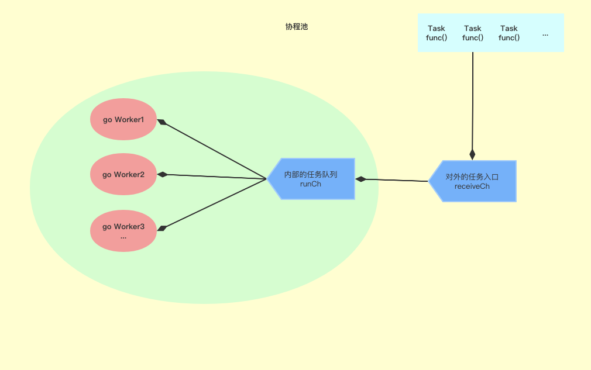

# 思路



<font color=green size=5x>图中看到，任务类型task是func()，外部一个接收的chan，不断的接收同步给runChan，然后根据需要启动了一定数量的协程，监控内部的runChan协程，生产者消费者的模式。</font>


<font color=green size=5x>启动的协程负责监控runChan，做到了不退出操作，因为接收的是func()，直接执行就行。所以做到了不必频繁的创建，而创建好的go程，栈空间的变量等信息也会随着执行func的完毕而自动销毁。</font>


```go
go build -gcflags "-N -l -m" && GODEBUG="gctrace=1"  go run main.go
-m 会打印出逃逸分析的优化策略，实际上最多总共可以用 4 个 -m，但是信息量较大，一般用 1 个就可以了。

-l 会禁用函数内联，在这里禁用掉 inline 能更好的观察逃逸情况，减少干扰。

gctrace=1 追踪垃圾回收
```

